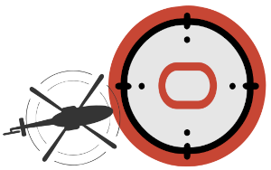

# OCI Landing Zones AI Transaction Monitoring Workload

Welcome to the [OCI Landing Zones (OLZ) Community](https://github.com/oci-landing-zones)! OCI Landing Zones simplify onboarding and running on OCI by providing design guidance, best practices, and pre-configured Terraform deployment templates for various architectures and use cases. These enable customers to easily provision a secure tenancy foundation in the cloud along with all required services, and reliably scale as workloads expand.

This repository contains Terraform modules for managing AI transaction monitoring workload resources in OCI (Oracle Cloud Infrastructure). By workload we mean resources that are typically deployed within a landing zone, and may trigger OCI consumption. By secure we mean they are designed to cover the key security features available in the OCI platform. When appropriate, the modules align with CIS OCI Foundations Benchmark recommendations.

The following modules are available:

- [net_instance.tf](./net_instance.tf) - supporting GPU-based compute with block volume storage
- [net_lb.tf](./net_lb.tf) -  support for an optional public load balancer.

Note that to use  NVIDIA GPU compute instances in an OCI Availability Domain (AD), a prerequisite is to increase service limit counts for the GPU shape(s) you need to use.  Before attempting to deploy this workload, please make the necessary adjustments under Tenancy Administration > Limits, Quotas and Usage.

See [Known Issues](#known-issues) below for more details, including how to accept the "Oracle and Nvidia Terms of Use".

With this module you find an *examples* folder. The example is a fully runnable Terraform configuration (without the public load balancer) that you can quickly test and put to use by modifying the input data according to your own needs.  
## CIS OCI Foundations Benchmark Modules Collection

This repository is part of a broader collection of repositories containing modules that help customers align their OCI implementations with the CIS OCI Foundations Benchmark recommendations:
- [Identity & Access Management](https://github.com/oracle-quickstart/terraform-oci-cis-landing-zone-iam)
- [Networking](https://github.com/oracle-quickstart/terraform-oci-cis-landing-zone-networking)
- [Governance](https://github.com/oracle-quickstart/terraform-oci-cis-landing-zone-governance)
- [Security](https://github.com/oracle-quickstart/terraform-oci-cis-landing-zone-security)
- [Observability & Monitoring](https://github.com/oracle-quickstart/terraform-oci-cis-landing-zone-observability)
- [Secure Workloads](https://github.com/oracle-quickstart/terraform-oci-secure-workloads) - current repository

The modules in this collection are designed for flexibility, are straightforward to use, and enforce CIS OCI Foundations Benchmark recommendations when possible.

Using these modules does not require a user extensive knowledge of Terraform or OCI resource types usage. Users declare a JSON object describing the OCI resources according to each module’s specification and minimal Terraform code to invoke the modules. The modules generate outputs that can be consumed by other modules as inputs, allowing for the creation of independently managed operational stacks to automate your entire OCI infrastructure.

## Help

Open an issue in this repository.

## Contributing

This project welcomes contributions from the community. Before submitting a pull request, please [review our contribution guide](./CONTRIBUTING.md).

## Security

Please consult the [security guide](./SECURITY.md) for our responsible security vulnerability disclosure process.

## License

Copyright (c) 2025 Oracle and/or its affiliates.
Released under the Universal Permissive License v1.0 as shown at <https://oss.oracle.com/licenses/upl/>.

## Known Issues 

**1. Compute GPU Shapes Availability**

  * In order to use GPU shapes for compute instances, the landing zone tenancy needs Compute service limits increased to two or more for at least one of these resource limits:

   - GPUs for GPU2 based VM and BM Instances: `vm-gpu2-1-count` X7-based GPU compute with NVIDIA Tesla P100 16 GB
   - GPUs for GPU3 based VM and BM Instances: `vm-gpu3-1-count` X7-based GPU compute with NVIDIA Tesla V100 16 GB
   - GPUs for GPU.A10 based VM and BM Instances: `gpu-a10-count` X9-based GPU compute with NVIDIA A10 24 GB

  Once capacity limits are increased, availability of GPU shapes requires a one-time acceptance of the "Oracle and Nvidia Terms of Use" agreement. **From the OCI console, create an initial temporary instance with a GPU shape and check the box** for "I have reviewed and accept the following documents:" and select the shape. Create the instance in any compartment and then terminate it in the console. Subsequent landing zone instances with GPU shapes from Terraform will be allowed unimpeded.

