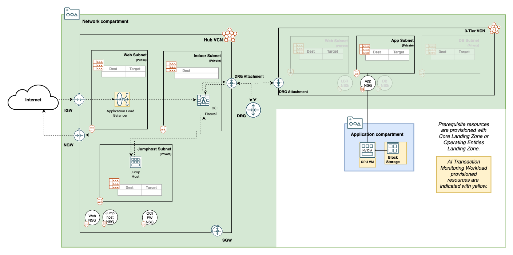

# AI Transaction Monitoring Workload Deployment Guide

This template shows how to deploy an AI Transaction Monitoring Workload using an OCI Core Landing Zone configuration.

In this template, a single GPU-based compute instance is deployed, optionally with a dedicated application load balancer and backend set.
The following prerequisite resources are assumed to exist prior to deploying this workload:

- a workload compartment for holding the compute instance and block volume
- an application compartment with a private application subnet with a VCN, including a DRG and NAT gateway for outbound access to the internet.
- optionally, a public web subnet for holding a load balancer used in a mesh network environment.

Because this module deploys a Graphical Processing Unit (GPU) based compute instance, the first task is to enable that capacity in your tenancy.  See the *Deploy* section of the companion [README](README.md) file for instructions on increasing GPU Service Limits before attempting to deploy.

## Architectural Overlay

Before you can deploy this module, there must be existing tenancy resources (compartments, VCNs, subnets, etc.) that provide a foundation for the workload or application. The information here assumes you will use [Core Landing Zone](https://github.com/oci-landing-zones/terraform-oci-core-landingzone) for the base deployment. Alternatively, you may choose to use [Operating Entities Landing Zone](https://github.com/oci-landing-zones/oci-landing-zone-operating-entities) depending on your organization and workload size or complexity.

The diagram below shows the AI Transaction Monitoring Workload deployed resources as indicated with a yellow background.  All other resources are deployed as a prerequisite by Core Landing Zone with the following user supplied options:

- Networking topology: Hub and Spoke model (Hub/DMZ VCN with a DRG), which includes subnets and NSGs for web, indoor firewall and jump host uses.  This option also provides a NAT gateway, which is needed for externally available code installed on the compute instance.
- OCI Firewall in the Hub/DMZ VCN, required for proper routing within the landing zone.
- Bastion jump host, with Oracle Linux 8 STIG image, in the Hub/DMZ VCN, required for SSH access to the compute instance on a private subnet.
- A single Three Tier VCN (spoke) attached to the DRG, which includes an application subnet and its associated NSG.

A separate application compartment is deployed automatically by Core Landing Zone.  OCID values from these prerequisite resources are used as input to this module for placement of the compute instance, associated block storage and application load balancer, if included.
 

The decision on whether or not to use a public load balancer is based on the number of spokes in your network. Normally in a Hub and Spoke topology, a load balancer is only used for local scaling and to allow internet traffic. In order to support both network use cases, a load balancer can optionally be deployed.

## Default Values

This template has the following parameters set:

| Variable Name | Description | Value | Options |
|---|---|---|---|
| workload\_name | Name of the workload. Default name is TMS. | TMS | |
| workload\_compartment\_ocid | OCID of the existing Workload Compartment. | | |
| app\_subnet\_compartment\_ocid | OCID of the existing Network Compartment. | | |
| app\_subnet\_ocid | OCID of the existing App Subnet. | | |
| app\_nsg\_ocid | OCID of the existing App NSG. | | |
| add\_lb | Whether to deploy a load balancer. If set to true, a load balancer will be deployed and the compute instance will be attached to the backend server. If set to false, the load balancer and backend set will not be created. | false | |
| lb\_subnet\_compartment\_ocid | OCID of the Load Balancer compartment. | | |
| lb\_subnet\_ocid | OCID of the existing LB Subnet. | | |
| compute\_shape | GPU-based shape of the compute instance. | VM.GPU.A10.1 | |
| compute\_boot\_volume\_size | Boot volume size (in GBs) of the compute instance. | 250 | |
| compute\_ssh\_public\_key | Public SSH Key used to access the compute instance. | | |
| compute\_availability\_domain | Availability domain where the compute instance will be deployed. Default is AD-1. | 1 | |
| compute\_fault\_domain | Fault domain where the compute instance will be deployed. Default is FD-1. | 1 | |
| block\_volume\_size | Block volume size (in GBs) to be attached to the compute instance. | 200 | |

For a detailed description of all variables that can be used, see the [SPEC.md](SPEC.md) documentation.

This template can be deployed using OCI Resource Manager Service (RMS) or Terraform CLI:

## OCI RMS Deployment

By clicking the button below, you are redirected to an OCI RMS Stack with variables pre-assigned for deployment.

[](https://cloud.oracle.com/resourcemanager/stacks/create?zipUrl=https://github.com/oci-landing-zones/terraform-oci-workloads-ai/archive/refs/heads/main.zip&zipUrlVariables={"workload_name":"TMS","workload_compartment_ocid":"","app_subnet_compartment_ocid":"","app_subnet_ocid":"","app_nsg_ocid":"","add_lb":false,"lb_subnet_compartment_ocid":"","lb_subnet_ocid":"","compute_shape":"VM.GPU.A10.1","compute_boot_volume_size":"250","compute_ssh_public_key":"","compute_availability_domain":"3","compute_fault_domain":"3","block_volume_size":"200"})

You are required to review/adjust the following variable settings:

- Provide existing OCIDs for *workload\_compartment\_ocid*, *app\_subnet\_compartment\_ocid*, *app\_subnet\_ocid*, and if opted for, *lb\_subnet\_compartment\_ocid* and *lb\_subnet\_\_ocid* fields.
- Check *add\_lb* option in case it is desired.
- Make sure to enter the *compute\_ssh\_public\_key* variable with a public SSH key for the compute instance.
- Be sure to adjust *compute\_availability\_domain* and *compute\_fault\_domain* to match your GPU shape availability.

With the stack created, perform a Plan, followed by an Apply using RMS UI.

## Terraform CLI Deployment

1. Rename file *main.tf.template* to *main.tf*.
2. Provide/review the variable assignments in *main.tf*.
3. In this folder, execute the typical Terraform workflow:

	``
	terraform init
	``
	
	``
	terraform plan
	``
	
	``
	terraform apply
	``

