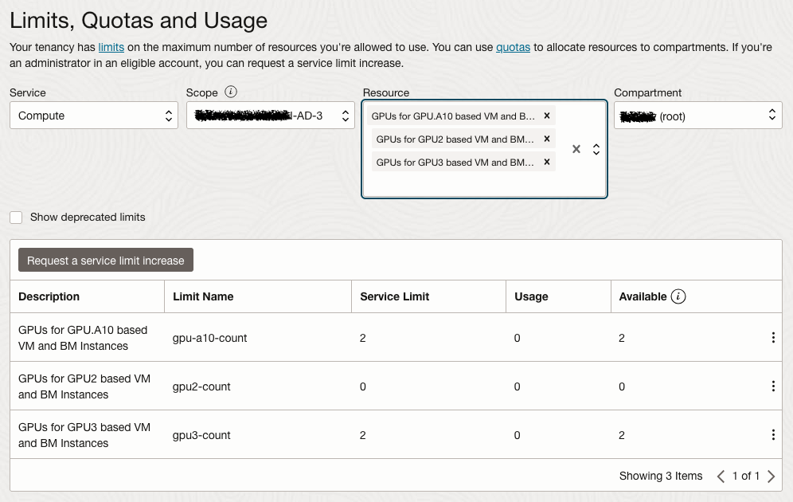

# OCI Landing Zones AI Transaction Monitoring Workload


Welcome to the [OCI Landing Zones (OLZ) Community](https://github.com/oci-landing-zones)! OCI Landing Zones simplify onboarding and running on OCI by providing design guidance, best practices, and pre-configured Terraform deployment templates for various architectures and use cases. These enable customers to easily provision a secure tenancy foundation in the cloud along with all required services, and reliably scale as workloads expand.

## Overview

This repository contains Terraform modules for managing AI transaction monitoring workload resources in OCI (Oracle Cloud Infrastructure).
This module can be deployed on top of the [Core Landing Zone](https://github.com/oci-landing-zones/terraform-oci-core-landingzone) or [Operating Entities Landing Zone](https://github.com/oci-landing-zones/oci-landing-zone-operating-entities), depending on customer organization and workload size/complexity.

By workload we mean resources that are typically deployed within a landing zone, and may trigger OCI consumption. By secure we mean they are designed to cover the key security features available in the OCI platform. When appropriate, the modules align with CIS OCI Foundations Benchmark recommendations.

The AI Transaction Monitoring Workload deploys a GPU-based compute instance to apply federated learning to a NVFlare Graph Neural Network (GNN) model, specifically using GraphSAGE for tasks like transactional fraud detection by using the following steps:

- Setting up and initializing a GNN model (GraphSAGE) using PyTorch Geometric: This model learns representations of nodes in a graph, making it well-suited for tasks like classifying transactions based on their connections.
- Employing Federated Learning: This means multiple clients (e.g., banks or organizations) collaborate to train a shared model without sharing their private data. Each client trains the model locally on their data, and only the model updates are shared with a central server. The server aggregates these updates to improve the global model.
- GNN Model Definition: The GNN model is defined in the configuration files or Python scripts provided in the example. The model architecture (e.g., number of layers, hidden units) is specified in these scripts.
- Training: Commands like nvflare simulator or nvflare job submit initiate training in a federated setting. Each site (client) trains the GNN model locally, and results are aggregated by the central server.
- Inference Model: After training, the resulting model can be used for inference—making predictions on new, unseen transactions by analyzing their graph-based connections. This step is also included in the workflow to evaluate the model’s effectiveness after training.

In short, this workload deploys a compute instance with a script to automate setting up a GNN model, applying federated learning to train it across multiple clients, and using the trained model to make predictions about transactions.

The following modules are available:

- [net_instance.tf](net_instance.tf) - supporting GPU-based compute with block volume storage
- [net_lb.tf](net_lb.tf) -  support for an optional public load balancer.

### Script Actions

The compute instance deployed runs an initialization script, which automates the setup of the environment required to run the GNN transactional classification model using the Elliptic++ dataset, including downloading various third-party libraries and software like Docker and Python. Below is a breakdown of the actions performed by the script:

1. Package Installation - Installs essential system packages like dnf-utils, zip, unzip, and gcc for compiling and managing software. Configures Docker repositories and installs Docker to enable containerized environments. Enables Docker services to start automatically. Installs the NVIDIA container toolkit to allow for GPU support within Docker containers.

2. Python Environment Setup - Installs python3-pip to manage Python packages and installs/upgrades Python-related tools such as pip, wheel, and oci-cli. Installs specific Python libraries like langchain and six, which are needed for various components of the project.

3. Storage Configuration - Uses Oracle's oci-growfs tool to automatically grow the filesystem to take advantage of all available space.

4. Transaction Monitoring Setup - Installs Python 3.9, git, and additional tools like wget, unzip, and firewalld (for managing firewall rules). Sets Python 3.9 as the default Python version. Installs data science packages such as jupyter, numpy, pandas, matplotlib, and tqdm to support machine learning workflows.

5. NVFlare Setup - Installs NVFlare, NVIDIA's federated learning framework. Clones the NVFlare GitHub repository and switches to the 2.4 branch to ensure the correct version for the example. Installs all Python dependencies needed to run the Graph Neural Network (GNN) example using pip and the requirements.txt file from the repository.

6. PyG Package Installation - Installs additional PyTorch Geometric (PyG) packages required to implement the GraphSAGE model, ensuring compatibility with PyTorch 2.4.

7. Dataset Setup - Creates a directory to store the Elliptic++ dataset and downloads it from Oracle's Object Storage. Unzips the dataset and moves it to the correct directory structure for NVFlare.

8. NVFlare Configuration - Configures NVFlare using predefined job templates and sets up the necessary environment to run federated learning with the GraphSAGE model.

9. Model Training - Runs the GraphSAGE financial classification script locally for each client using the graphsage_finance_local.py script to simulate training on different clients.

10. Create and Run Federated Learning Job - Creates a new NVFlare job that defines the GraphSAGE model training process in a federated setting. Specifies configurations such as the number of training rounds, the model's architecture, and key metrics like validation_auc.

11. NVFlare Simulator Execution - Runs the NVFlare simulator with two clients to test the federated learning job in a simulated environment.

12. Firewall Configuration for TensorBoard - Configures firewall settings to open port 6006 to allow external access to TensorBoard, which will be used to monitor training progress.

13. TensorBoard Startup - Starts TensorBoard, allowing users to visualize and track the performance of the GNN model during training.

14. Jupyter Notebook Setup - Deploys a Jupyter notebook server inside a Docker container, exposing it on port 8888. Clones a repository with preconfigured transaction monitoring notebooks to provide a ready-to-use environment for experimentation.

15. Firewall Configuration for Jupyter - Configures the firewall to open port 8888 for external access to the Jupyter notebook interface.

### Inference Process

1. Prepare New Transaction Data: You need to format the new transaction (or a batch of transactions) in the same way you prepared the data for training (e.g., as node features in a graph for GNNs).
2. Load the Model and Input Data: Load the trained model (as we discussed in the previous response) and pass the new transaction data into it.
3. Make a Prediction: The model will output a result based on the input data. For a fraud detection model, this could be:
    - A probability or confidence score (e.g., 0.95 means 95% chance the transaction is fraudulent)
    - A binary label (e.g., 0 = not fraudulent, 1 = fraudulent)

    
To test the trained model, load the required libraries and ensure you have all necessary libraries installed, such as PyTorch and PyTorch Geometric.
   
`` pip install torch torch-geometric ``

You need to prepare your new transaction data in the format expected by the model. Since you're using a GNN model like GraphSAGE, the input is typically a graph with nodes representing transactions and edges representing relationships between transactions (e.g., same account, related transactions, etc.).

In your Python script or interactive environment, load the model file (FL_global_model.pt) that was saved after training.

```python
import torch

# Load the trained model from the file
model_path = 'finance_fl_workspace/simulate_job/app_server/FL_global_model.pt'
model = torch.load(model_path)

# Set the model to evaluation mode (important for inference)
model.eval()
```

Once you have the data in the right format, you can pass it through the model to make predictions. The model will then output a result based on the input data.


## Deployment

Please see the [Deployment Guide](DEPLOYMENT-GUIDE.md) for instructions on how to set up an OCI tenancy as a prerequisite. See also the details below on making GPU compute capacity available in that tenancy.

### GPU Compute Capacity

Note that to use NVIDIA GPU compute instances in an OCI Availability Domain (AD), a prerequisite is to increase service limit counts for the GPU shape(s) you need to use.  Before attempting to deploy this workload, please **open an OCI service request to make the necessary adjustments** under Tenancy Administration > Limits, Quotas and Usage.



See [Known Issues](#known-issues) below for more details, including how to accept the "Oracle and Nvidia Terms of Use".


## CIS OCI Foundations Benchmark Modules Collection

This repository is part of a broader collection of repositories containing modules that help customers align their OCI implementations with the CIS OCI Foundations Benchmark recommendations:
- [Identity & Access Management](https://github.com/oci-landing-zones/terraform-oci-modules-iam)
- [Networking](https://github.com/oci-landing-zones/terraform-oci-modules-networking)
- [Governance](https://github.com/oci-landing-zones/terraform-oci-modules-governance)
- [Security](https://github.com/oci-landing-zones/terraform-oci-modules-security)
- [Observability & Monitoring](https://github.com/oci-landing-zones/terraform-oci-modules-observability)
- [Secure Workloads](https://github.com/oci-landing-zones/terraform-oci-modules-workloads) 

The modules in this collection are designed for flexibility, are straightforward to use, and enforce CIS OCI Foundations Benchmark recommendations when possible.

Using these modules does not require a user extensive knowledge of Terraform or OCI resource types usage. Users declare a JSON object describing the OCI resources according to each module’s specification and minimal Terraform code to invoke the modules. The modules generate outputs that can be consumed by other modules as inputs, allowing for the creation of independently managed operational stacks to automate your entire OCI infrastructure.

## Help

Open an issue in this repository.

## Contributing

This project welcomes contributions from the community. Before submitting a pull request, please [review our contribution guide](../ai_transaction_monitoring_workload/CONTRIBUTING.md).

## Security

Please consult the [security guide](../ai_transaction_monitoring_workload/SECURITY.md) for our responsible security vulnerability disclosure process.

## License

Copyright (c) 2025 Oracle and/or its affiliates.
Released under the Universal Permissive License v1.0 as shown at <https://oss.oracle.com/licenses/upl/>.

## Known Issues <a id='known-issues'></a>

**1. Compute GPU Shapes Availability**

  * In order to use GPU shapes for compute instances, the landing zone tenancy needs Compute service limits increased to two or more for at least one of these resource limits:

   - GPUs for GPU2 based VM and BM Instances: `vm-gpu2-1-count` X7-based GPU compute with NVIDIA Tesla P100 16 GB
   - GPUs for GPU3 based VM and BM Instances: `vm-gpu3-1-count` X7-based GPU compute with NVIDIA Tesla V100 16 GB
   - GPUs for GPU.A10 based VM and BM Instances: `gpu-a10-count` X9-based GPU compute with NVIDIA A10 24 GB

  Once capacity limits are increased, availability of GPU shapes requires a one-time acceptance of the "Oracle and Nvidia Terms of Use" agreement. **From the OCI console, create an initial temporary instance with a GPU shape and check the box** for "I have reviewed and accept the following documents:" and select the shape. Create the instance in any compartment and then terminate it in the console. Subsequent landing zone instances with GPU shapes from Terraform will be allowed unimpeded.

**2. GPU Compute Fault Domain Location**

  * Terraform Apply will fail if the GPU capacity is not in the indicated Fault Domain.  The Fault Domain value is required, but there is no way to verify that value beforehand in the OCI console.  You may have to retry the Apply after incrementing the Fault Domain value.

  ```
    Error: 500-InternalError, Out of host capacity.

    Further Information: Out of capacity for shape VM.GPU.A10.1 in availability domain wxyz:US-ASHBURN-AD-1 and fault domain FAULT-DOMAIN-1. Try creating the instance without specifying fault domain or try again later.
  ```
